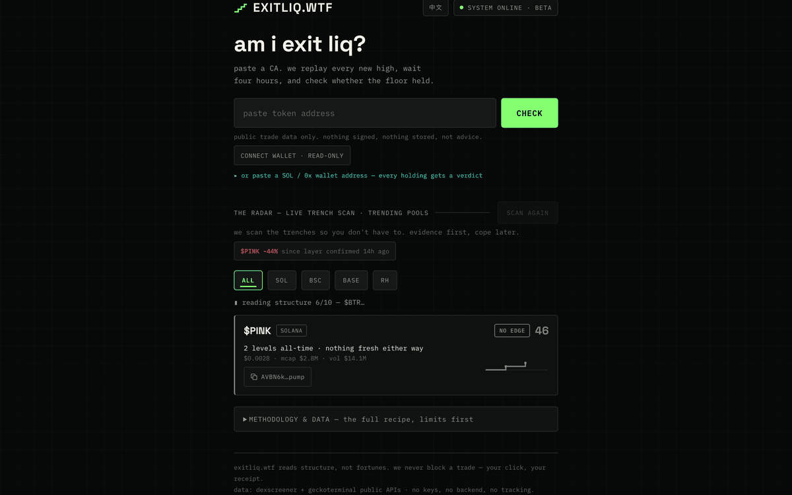

<div align="center">

# exitliq.wtf

[English](README.md) · **中文**

### am i exit liq? — 在点下"买入"之前,先知道答案。

粘贴一个合约地址(CA)。它回放每一次创新高,等四个小时,
检查地板有没有守住。几秒钟拿到判决。

**[▶ 在线体验](https://exitliq.wtf)** · 无需注册 · 不签名、不存储 · 非投资建议



### 零后端 · 零 API key · 零成本

一切都在**你自己的**浏览器里运行,直连两个公开 API。
你和数据之间没有任何服务器,没有任何跟踪。整个引擎就是一个 HTML 文件——
打开它、读它、fork 它。**Don't trust — verify.**

</div>

---

## 它做什么

**🎯 CHECK — 一个 CA,一张判决。** 粘贴任意代币地址(或打开 `?t=<地址>` 深链),得到一张判决卡:`PVE_MOMENT`、`PVE_BUILDING`、`EXIT_LIQ`、`PVP_CHURN`、`STRUCT_RISK`…… 资产域闸门会把主流币、稳定币和 CEX 定价资产拦下来,输出 **"NOT A TRENCH ASSET"**,而不是给一个假分数。

**🛰 THE RADAR — 实时战壕扫描。** 首页拉取 SOL / BSC / BASE / ROBINHOOD 的热门池子,滤掉主流币和稳定币,对每条链的头部池子回放层级状态机,按 PVE MOMENT → BUILDING → 风险状态排序输出信息流。回执条会标出过去 24 小时每一个守住的层级的后续表现("$KEYCAT 层级守住 22 小时后 +6%")——确定性的自我回测,没有后端。浏览器会记住每个代币上次的信号(localStorage),下次打开时标出变化。

**👜 BAG SCAN — 每个持仓一张判决。** 只读连接钱包,或直接粘贴 SOL / 0x 钱包地址。不签名,不存储。

## 为分享而生

- `?t=<地址>` 深链 — 每个被分享的判决在打开时**实时重跑验证**
- **SHARE VERDICT ON 𝕏** — 预填好分数、层级和判决的推文
- **DOWNLOAD RECEIPT PNG** — canvas 渲染的回执卡,配图发帖用

## 判决是怎么来的

引擎是 **LAYERS**,一个买家层级状态机:突破 = 收盘价高出滚动 ATH ≥2%。4 小时后复查:守住 ≥85% → 该层级**确认**(一层守住了的买家);≤60% → **round-trip**(涨上去又跌回来,这批买家成了退出流动性)。

分数 = 层级 (.35) + 买压 (.25) + 连续性 (.15) + 量能趋势 (.10) + 留存 (.15)。

| 判决 | 触发条件 |
|---|---|
| EXIT_LIQ | ≤12 小时内出现 round-trip,此后无层级守住 |
| PVE_MOMENT | 分数 ≥62 且 96 小时内 ≥1 个层级守住 |
| PVE_BUILDING | 突破正在进行,分数 ≥45 |
| PVP_CHURN | 换手 >3× 市值,从未有层级守住 |
| STRUCT_RISK | 分数 ≤45 |
| TOO_EARLY | K 线不足 8 小时 |
| NEUTRAL | 其余情况 |

阈值就在 `<script>` 块顶部(`BREAKOUT/CONFIRM_H/HOLD/FAIL`)——改完重新部署即可。

## 引擎盖下面

两个免费公开 API,都开放 CORS,由你的浏览器直接调用:

- DexScreener `latest/dex/tokens/{address}` — 实时交易对、价格、买卖单、交易量、市值
- GeckoTerminal `networks/{net}/pools/{pool}/ohlcv/hour` — 最多 1000 根小时 K(约 41 天)

**中心化扫描(beta)。** 每个访客各自扫描,既各自撞上按 IP 的限流,又在重复计算同样的结果。解法:**扫一次,服务所有人。**

- `scanner.mjs` — 同一引擎的 Node 移植;写出 `feed.json`,并把每个判决追加进 `verdicts.jsonl`(回执账本)。**git 历史让时间戳防篡改。**
- `.github/workflows/scan.yml` — 定时运行,提交输出
- `index.html` — 加载时先读 `feed.json`(新鲜 → 中心模式:秒开,浏览器零 API 调用)。缺失/过期 → 回退浏览器本地扫描。`?solo=1` 强制本地模式。

## 本地运行

```bash
python3 -m http.server 8471
# 打开 http://localhost:8471
```

## 部署你自己的 fork(全部免费)

- **GitHub Pages**:推送后启用 Pages(main 分支根目录)→ 在 Actions 页手动跑一次 "radar scan" → 绑定域名
- **Vercel**:在目录里 `npx vercel deploy`,或把文件夹拖进 vercel.com/new
- **Netlify**:把文件夹拖到 app.netlify.com/drop

没有构建步骤。`index.html` 就是整个产品。

## 已知局限(v0,有意为之)

- 41 天 ATH 窗口(GeckoTerminal 免费档)——"ATH" 指窗口内高点,不是历史最高
- 买压取的是 24 小时交易对级买卖单,未按 ATH 邻近度过滤
- 回执由客户端生成:带时间戳,但尚不可服务端验证
- 无持有人数据(那是付费 API 的 v2)

---

*exitliq 读的是结构,不是命运。它从不拦着你交易——你的点击,你的回执。*
***本页一切内容均非投资建议。***
